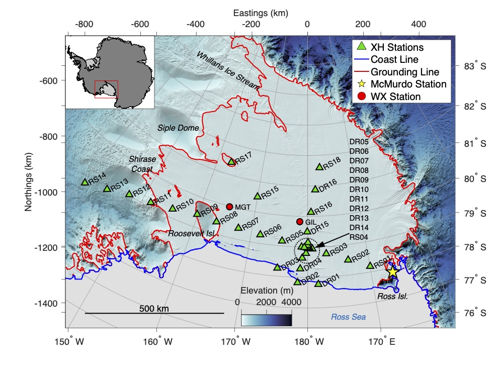

# RISWorkflow

This repository contains data and instructions for how to implement deep embedded clustering (DEC) and Gaussian mixture model (GMM) clustering of seismic data recorded on the Ross Ice Shelf, Antarctica from 2014-2017. This package is an accompaniment to the [paper published in the Journal of Geophysical Research: Solid Earth](https://doi.org/10.1029/2021JB021716).

The workflow is as follows:
1. Load and pre-process seismic data.
2. Use a convolutional auto-encoder to reduce dimensionality of input data.
3. Perform GMM clustering on latent data.
4. Perform DEC clustering on latent data.
5. Compare results in latent space and data space.

***
### Installation
1. Install RISCluster using instructions contained in the [RISCluster repository readme.md](https://github.com/NeptuneProjects/RISCluster#installation).
2. Clone this repository to your desired working directory.
3. Download [environmental data](https://drive.google.com/file/d/16qJWTN-SVUs9CpLaQ3wt3Bct5BPb2qdV/view?usp=sharing) and unzip contents into `/Data`.

***
### Usage
The Jupyter notebook **[Workflow.ipynb](https://github.com/NeptuneProjects/RISWorkflow/blob/main/Workflow.ipynb)** contains an end-to-end workflow control that guides the user through all steps of the project, including downloading and pre-processing the seismic data.  Required directories, configuration files, and command-line scripts are generated within the notebook.  For main routine execution, commands are copied from the Jupyter notebook into a terminal window.

Downloading and processing seismic data can take a long time. For access to the pre-processed seismic data set (16 GB), please contact me and we can arrange how best to transfer the file.

***
### References
William F. Jenkins II, Peter Gerstoft, Michael J. Bianco, Peter D. Bromirski; *[Unsupervised Deep Clustering of Seismic Data: Monitoring the Ross Ice Shelf, Antarctica.](https://onlinelibrary.wiley.com/share/author/QI3MB3SGBPRGJISHRJGJ?target=10.1029/2021JB021716)* Journal of Geophysical Research: Solid Earth, 30 August 2021; doi: https://doi.org/10.1029/2021JB021716

Dylan Snover, Christopher W. Johnson, Michael J. Bianco, Peter Gerstoft; *Deep Clustering to Identify Sources of Urban Seismic Noise in Long Beach, California.* Seismological Research Letters 2020; doi: https://doi.org/10.1785/0220200164

Junyuan Xie, Ross Girshick, Ali Farhadi; *Unsupervised Deep Embedding for Clustering Analysis.* Proceedings of the 33rd International Conference on Machine Learning, New York, NY, 2016; https://arxiv.org/abs/1511.06335v2
***
### Author
Project assembled by William Jenkins
 wjenkins [@] ucsd [dot] edu
 Scripps Institution of Oceanography
 University of California San Diego
 La Jolla, California, USA
